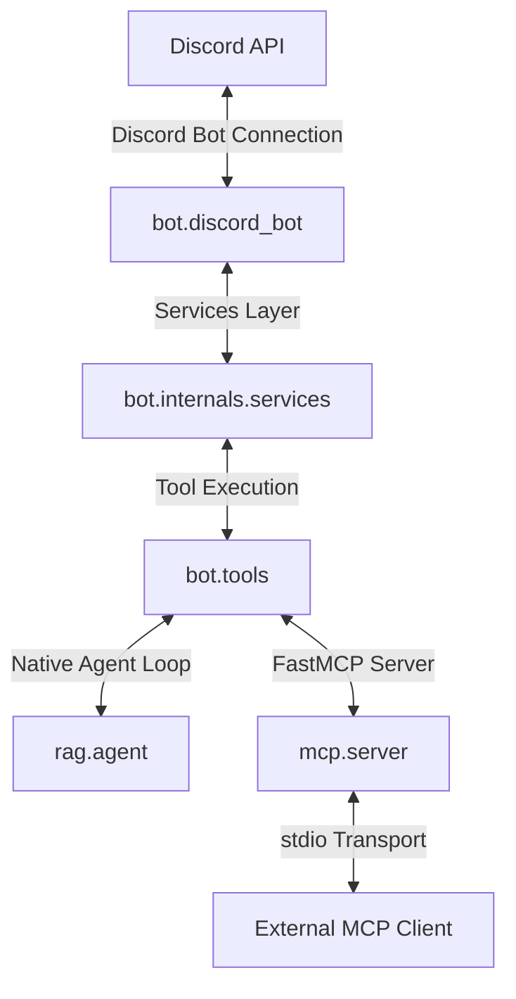

# Totally-Not-a-Discord-Bot-MCP

Totally-Not-a-Discord-Bot (Totally-not-a-Bot) is an agent loop + MCP server for agentic AIs to interact in discord servers with a particular focus on moderation and security. 

I started this project because I wanted to become familiar with developing MCPs. I was able to struggle with certain architectural choices, logic, and other decisions that influenced the whole project. I built many mental models about MCPs and agentic AIs, and if I ever have to develop another MCP in the future, it'll go by way faster, and be a much more efficient process. 

## Project Map

```
docs/
|--tdd/tdd.md
|--todo.md
scripts/
|--tests.py
src/
|--bot/
|   |--internals/
|   |--tools/
|   |--app.py
|   |--discord_bot.py
|   |--exceptions.py
|   |--models.py
|--mcp/
|   |--server.py
|--rag/
|   |--agent.py
|   |--main.py
|--.env.example
|--.ruff.toml
|--pixi.lock
|--pixi.toml
|--README.md
```

## Prerequisites and Environment Setup

To locally run **Totally-not-a-Bot**, ensure you have the following prerequisites installed on your system:

- **Python**: Version `3.12` or higher (configured in `pixi.toml`).
- **Pixi**: A [modern package manager](https://pixi.prefix.dev/latest/installation/).
- **Discord Bot**: A [Discord Bot](https://discord.com/developers/applications) with the necessary permissions enabled (see the [Quick Start](#getting-a-discord-bot) guide below).

#### Local Repository Setup

1. Set up your .env by copying the example file:
   ```bash
   cp .env.example .env
   ```
2. Initialize the environment and install dependencies:
   ```bash
   pixi install
   ```

## Quick Start and Configuration

### Getting a Discord Bot

You'll need to set up your own Discord application for your MCP to access:

1. Go to the [Discord Developer Portal](https://discord.com/developers/applications)
2. Create a new application or use an existing one
3. Go to the "Bot" section and create a bot if you haven't already -> needs bot, admin, and application id perms
4. Copy the bot token and set it as `DISCORD_BOT_TOKEN` in your `.env` file
5. To get your server id, right click the server icon, hover over 'Copy Server Info,' and copy the server ID
6. Set this as `DISCORD_BOT_GUILD` in your `.env` file
7. Make sure that you have enabled all intents -> bot tab

### Starting the Application

Once your `.env` file has your bot token and guild id, you can launch the application using Pixi. You can choose to run either the MCP Server or the Autonomous Bot using the available commands:

#### 1. Standalone MCP Server
To expose the bot's tools via standard input/output (`stdio`) for external AI clients (like Claude Desktop) without the bot autonomously acting:
```bash
pixi run mcp
```

#### 2. Standalone Autonomous Bot
To run the bot with its native LangChain loop managing the server autonomously, without exposing the MCP server:
```bash
pixi run bot
```

## Architecture

**Totally-not-a-Bot** utilizes a multi-threaded asynchronous architecture designed to connect your AI agent to your Discord bot. The codebase is decoupled into three distinct pillars:



- **Core Bot (`src/bot/`)**: Manages model definitions, exception maps, and initializes the Discord client. The Services layer executes operations inside Discord, and the Tools layer provides standardized function wrappers.
- **RAG Agent (`src/rag/`)**: Contains the native LangChain agent loop (`agent.py`) which processes Discord chat organically by directly invoking the `bot.tools` Python functions.
- **MCP Server (`src/mcp/`)**: Implements a declarative tool injection mechanism using FastMCP, wrapping the native `bot.tools` functions to expose them over standard input/output (`stdio`) for external AI agents.

## MCP Integration Guide

To connect **Totally-not-a-Bot** to your preferred AI agent client (e.g., Claude Desktop, Cursor, etc.), add the configuration block below to your MCP configuration file. Although, the best use I could think of for this MCP is to hook it up to an agent that has its own feedback loop. 

#### Claude Desktop Configuration
Add this to your `claude_desktop_config.json` (located at `~/Library/Application Support/Claude/claude_desktop_config.json` on macOS):

```json
{
  "mcpServers": {
    "totally-not-a-bot": {
      "command": "pixi",
      "args": [
        "run",
        "mcp"
      ],
      "env": {
        "DISCORD_BOT_TOKEN": "YOUR_DISCORD_BOT_TOKEN",
        "DISCORD_BOT_GUILD": "YOUR_DISCORD_BOT_GUILD"
      }
    }
  }
}
```

Ensure you replace `YOUR_DISCORD_BOT_TOKEN` and `YOUR_DISCORD_BOT_GUILD` with the actual ids or set them in your active system environment.

## Current Tools

**Totally-not-a-Bot** exposes a wide range of Discord API tools to agentic models, organized by functional category:

| Category | Tool Name | Description | Key Inputs |
| :--- | :--- | :--- | :--- |
| **Messages** | `get_recent_messages` | Fetches recent messages from a channel (default 20), optionally filtered by timestamp | `channel_id`, `limit`, `timestamp` |
| | `get_pinned_messages` | Fetches all pinned messages in a specific channel | `channel_id` |
| | `get_thread_from_message` | Fetches all threads started from a specific message | `channel_id`, `message_id` |
| | `send_message` | Sends a text message, optionally as a reply to another message | `channel_id`, `content`, `reply_to_message_id` |
| | `edit_message` | Edits an existing text message | `channel_id`, `message_id`, `new_content` |
| | `delete_message` | Deletes an existing message | `channel_id`, `message_id` |
| | `send_embed` | Sends an embed message | `channel_id`, `embed`, `reply_to_message_id` |
| | `edit_embed` | Edits an existing embed message | `channel_id`, `message_id`, `new_embed` |
| | `pin_message` | Pins a specific message in a channel | `channel_id`, `message_id`, `reason` |
| | `unpin_message` | Unpins a specific message in a channel | `channel_id`, `message_id`, `reason` |
| | `add_reaction` | Adds an emoji reaction to a message | `channel_id`, `message_id`, `emoji` |
| | `remove_reaction` | Removes an emoji reaction from a message | `channel_id`, `message_id`, `emoji` |
| **Channels** | `get_channel_info` | Fetches metadata for a specific channel | `channel_id` |
| | `get_all_channels_info` | Lists metadata and details for all channels in the guild | - |
| | `create_channel` | Creates a new text, voice, or stage channel | `name`, `type`, `category_id`, `position` |
| | `edit_channel` | Updates settings (name, topic, type, etc.) of an existing channel | `channel_id`, `name`, `topic`, `nsfw`, `slowmode_delay` |
| | `delete_channel` | Deletes a channel | `channel_id` |
| | `move_channel` | Moves a channel to a target category | `channel_id`, `category_id` |
| | `set_channel_position` | Adjusts the position/order of a channel | `channel_id`, `position` |
| | `bulk_create_channels` | Creates multiple channels simultaneously | `channels` (list) |
| | `bulk_edit_channels` | Updates multiple channels simultaneously | `channels` (list) |
| | `bulk_delete_channels` | Deletes multiple channels simultaneously | `channel_ids` (list) |
| **Categories**| `get_all_categories_info` | Fetches details and channel mappings for all categories | - |
| | `create_category` | Creates a new category | `name`, `position` |
| | `edit_category` | Renames or updates a category | `category_id`, `name` |
| | `delete_category` | Deletes a category | `category_id` |
| | `move_category` | Adjusts category ordering position | `category_id`, `position` |
| | `bulk_create_categories`| Creates multiple categories simultaneously | `categories` (list) |
| | `bulk_edit_categories` | Updates multiple categories simultaneously | `categories` (list) |
| | `bulk_delete_categories`| Deletes multiple categories simultaneously | `category_ids` (list) |
| **Users** | `get_user_info` | Resolves detailed profile, role, and server join details for a user | `user_id` |
| | `send_direct_message` | Sends a private message to a user | `user_id`, `content` |
| | `send_direct_message_with_embed` | Sends a private message with a rich embed | `user_id`, `embed` |
| **Roles** | `get_all_roles` | Lists details of all roles configured in the server | - |
| | `get_role_by_id` | Retrieves metadata of a specific role | `role_id` |
| | `assign_role_to_user` | Assigns a role to a server member | `user_id`, `role_id` |
| | `remove_role_from_user` | Removes a role from a server member | `user_id`, `role_id` |
| | `create_role` | Creates a new custom role with color/permissions | `name`, `color`, `hoist`, `mentionable` |
| | `edit_role` | Modifies an existing role's configuration | `role_id`, `name`, `color`, `hoist`, `mentionable` |
| | `delete_role` | Deletes a role from the server | `role_id` |
| **Profile** | `set_bot_status` | Updates the bot's active status (online, idle, dnd, offline) | `status` |
| | `set_bot_activity` | Updates the bot's active activity representation (playing, streaming, etc.) | `activity_type`, `name`, `url` |
| **Enforcement**| `mute_user` | Mutes a user in the server (text and voice), optionally for a timed duration | `user_id`, `duration_minutes` |
| | `unmute_user` | Unmutes a user in the server | `user_id` |
| | `kick_user` | Kicks a user from the server with an optional reason | `user_id`, `reason` |
| | `ban_user` | Bans a user from the server with an optional reason | `user_id`, `reason` |
| | `unban_user` | Unbans a user from the server | `user_id` |
| | `move_user` | Moves a user to a specified voice channel | `user_id`, `target_channel_id` |
| | `disconnect_user` | Disconnects a user from voice channels | `user_id` |

Many more to come! This project is still in active development and I have a lot left to implement and learn!

## Development Guide

If you want to contribute features, improve existing APIs, or write your own MCP tools, follow the guidelines below. On top of that, I really encourage anyone to make their own contributions, it'd be super fun to look over and I'd be happy to help.

### Adding a New MCP Tool

All tools are declaration-driven via **FastMCP**, meaning your Python signatures and docstrings directly generate the schemas utilized by the agent:

1. **Implement the Tool**: Open or create the appropriate tool module in `src/bot/tools/` (e.g., `enforcement_tools.py`). Define an asynchronous function, using `typing.Annotated` to describe each parameter:
   ```python
   from typing import Annotated
   
   async def example_tool(
       user_id: Annotated[int, "The target Discord user ID"],
       reason: Annotated[str | None, "The reason for this action"] = None
   ) -> str:
       """
       Brief description of what the tool does.
       
       Args:
           user_id (int): The target Discord user ID
           reason (str, optional): The reason for this action
       """
       # Your implementation logic using client services
       return "Success details"
   ```
2. **Register the Tool**: Open [src/mcp/server.py](file:///Users/archzak/Desktop/totally-not-a-bot/src/mcp/server.py), import your function, and add it to the MCP instance:
   ```python
   from bot.tools.enforcement_tools import example_tool
   
   mcp.add_tool(example_tool)
   ```
3. **Service Layer**: Make sure to write the actual logic inside the service layer, and if you need to, make a dto for returning Pydantic models to the AI.

---

### Pixi Development Tasks

I use **Pixi** for dependency management and reproducible development tasks. The following CLI commands are pre-configured:

| Command | Action | Details |
| :--- | :--- | :--- |
| `pixi install` | Install Dependencies | Initializes the virtual environment and syncs all libraries. |
| `pixi run mcp` | Start MCP Server | Spins up the Discord client and opens the stdio MCP server (native agent disabled). |
| `pixi run bot` | Start Bot | Spins up the autonomous Discord client with the native LangChain agent (MCP disabled). |
| `pixi run format` | Auto-format & Lint | Runs `ruff` to automatically format import ordering and syntax styling. |
| `pixi run testscript` | Run Test Script | Executes `scripts/tests.py` to verify server functionality. |
| `pixi add <pkg>` | Add Dependency | Installs a library and locks its version in `pixi.toml` / `pixi.lock`. |

---

## Contributing

Please feel free to contribute to **Totally-not-a-Bot**! Since this project is still in active development and was intended as a learning journey, please keep that in mind(I'm also a college student). I am always open to suggestions, features, improvements, and potential bug fixes.

I will add tempates for issues and pull requests whenever I can, but for now I'll just say that I'd like to keep the PRs small and focused on a single change. Also, if you're adding a new MCP tool, please make sure to update the tools table above to include the new tool.

Before submitting any code, please run the formatting task to keep the repository tidy. The branch can't be merged otherwise anyway:
```bash
pixi run format
```
