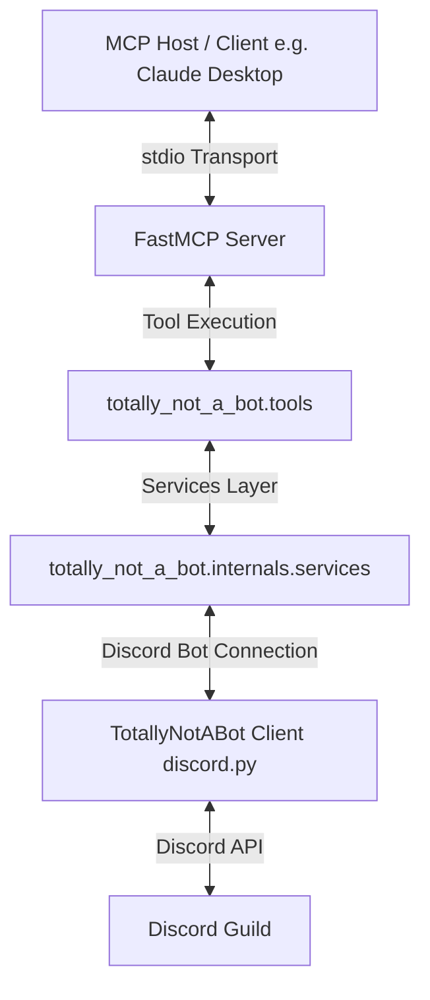

# Totally-not-a-Bot

Totally-not-a-Bot is an MCP for agentic AIs to interact in discord servers with a particular focus on moderation and security. 

I started this project because I wanted to become familiar with developing MCPs. I was able to struggle with certain architectural choices, logic, and other decisions that influenced the whole project. I was able to build many mental models about MCPs and agentic AI, and if I ever have to develop another MCP in the future, it'll go by way faster, and be a much more efficient process. 

README will be finished once the project reaches a solid enough state, and could be reasonably used. Still need to implement the enforcement tools, create memory layers to combine tool calls / make bulk actions, test suite needs to be made using pytest and pytest-asyncio, containerization, and put in more CI workflows. 

## Project Map

```
docs/
|--tdd/tdd.md
|--todo.md
scripts/
|--playground.py
src/
|   `totally_not_a_bot/
|    `--config/
|       |--app.py
|       |--discord_bot.py
|       |--exceptions.py
|       |--models.py
|    `--internals
|       |--dto/
|       |--services/
|    `--tools/
|   |--server.py
|--.env.example
|--.ruff.toml
|--pixi.lock
|--pixi.toml
|--README.md
```

## Prerequisites and Environment Setup

To locally run **Totally-not-a-Bot**, ensure you have the following prerequisites installed on your system:

- **Python**: Version `3.12` or higher (configured in `pixi.toml`).
- **Pixi**: A [modern package manager](https://pixi.prefix.dev/latest/installation/) for robust environmental isolation.
- **Discord Bot**: A [registered Discord Bot application](https://discord.com/developers/applications) with the necessary Gateway Intents enabled (see the [Quick Start](#getting-a-discord-bot) guide below).

#### Local Repository Setup

1. Set up your environment:
   ```bash
   cp .env.example .env
   ```
2. Initialize the environment and install dependencies:
   ```bash
   pixi install
   ```

## Quick Start and Configuration

### Getting a Discord Bot

You'll need to set up your own Discord application for your MCP to access:

1. Go to the [Discord Developer Portal](https://discord.com/developers/applications)
2. Create a new application or use an existing one
3. Go to the "Bot" section and create a bot if you haven't already -> needs bot, admin, and application id perms
4. Copy the bot token and set it as `DISCORD_BOT_TOKEN` in your `.env` file
5. To get your server id, right click the server icon, hover over 'Copy Server Info,' and copy the server ID
6. Set this as `DISCORD_BOT_GUILD` in your `.env` file
7. Make sure that you have enabled all intents -> bot tab

### Starting the MCP Server

Once your `.env` file has your bot credentials and guild configuration, you can launch both the Discord bot and the stdio MCP server using Pixi for local development:

```bash
pixi run dev
```

This launches:
1. An asynchronous Discord Bot client connection to your designated guild.
2. A local Model Context Protocol (MCP) server listening over standard input/output (`stdio`).

## Architecture

**Totally-not-a-Bot** utilizes a multi-threaded asynchronous architecture designed to bridge your AI agent to your Discord bot:



- **Asynchronous Execution**: Built on `asyncio`. The Discord client (`discord.Client`) runs in a background task on the event loop while the FastMCP standard I/O loop runs on the main thread, facilitating real-time interactions with zero latency blockages.
- **FastMCP Layer**: Implements a declarative tool injection mechanism (`mcp.add_tool`), mapping Python functions directly to model-callable actions.
- **Modular Components**:
  - **Config Layer ([app.py](file:///Users/archzak/Desktop/totally-not-a-bot/src/totally_not_a_bot/config/app.py))**: Manages model definitions, exception maps, and initializes the Discord client with `members` and `message_content` intents.
  - **Services Layer ([services](file:///Users/archzak/Desktop/totally-not-a-bot/src/totally_not_a_bot/internals/services/))**: Business logic executing target operations inside Discord channels.
  - **Tool Interfaces ([tools](file:///Users/archzak/Desktop/totally-not-a-bot/src/totally_not_a_bot/tools/))**: Standardized, annotated boundaries parsing and serving model inputs/outputs cleanly.

## MCP Integration Guide

To connect **Totally-not-a-Bot** to your preferred AI agent client (e.g., Claude Desktop, Cursor, etc.), add the configuration block below to your MCP configuration file.

#### Claude Desktop Configuration
Add this to your `claude_desktop_config.json` (located at `~/Library/Application Support/Claude/claude_desktop_config.json` on macOS):

```json
{
  "mcpServers": {
    "totally-not-a-bot": {
      "command": "pixi",
      "args": [
        "run",
        "dev"
      ],
      "env": {
        "DISCORD_BOT_TOKEN": "YOUR_DISCORD_BOT_TOKEN",
        "DISCORD_BOT_GUILD": "YOUR_DISCORD_BOT_GUILD"
      }
    }
  }
}
```

Ensure you replace `YOUR_DISCORD_BOT_TOKEN` and `YOUR_DISCORD_BOT_GUILD` with the actual credentials or set them in your active system environment.

## Current Tools

**Totally-not-a-Bot** exposes a wide range of Discord API tools to agentic models, organized by functional category:

| Category | Tool Name | Description | Key Inputs |
| :--- | :--- | :--- | :--- |
| **Messages** | `get_recent_messages` | Fetches recent messages from a channel (default 20), optionally filtered by timestamp | `channel_id`, `limit`, `timestamp` |
| | `get_pinned_messages` | Fetches all pinned messages in a specific channel | `channel_id` |
| | `get_thread_from_message` | Fetches all threads started from a specific message | `channel_id`, `message_id` |
| | `send_message` | Sends a text message, optionally as a reply to another message | `channel_id`, `content`, `reply_to_message_id` |
| | `edit_message` | Edits an existing text message | `channel_id`, `message_id`, `new_content` |
| | `delete_message` | Deletes an existing message | `channel_id`, `message_id` |
| | `send_embed` | Sends an embed message | `channel_id`, `embed`, `reply_to_message_id` |
| | `edit_embed` | Edits an existing embed message | `channel_id`, `message_id`, `new_embed` |
| | `pin_message` | Pins a specific message in a channel | `channel_id`, `message_id`, `reason` |
| | `unpin_message` | Unpins a specific message in a channel | `channel_id`, `message_id`, `reason` |
| | `add_reaction` | Adds an emoji reaction to a message | `channel_id`, `message_id`, `emoji` |
| | `remove_reaction` | Removes an emoji reaction from a message | `channel_id`, `message_id`, `emoji` |
| **Channels** | `get_channel_info` | Fetches metadata for a specific channel | `channel_id` |
| | `get_all_channels_info` | Lists metadata and details for all channels in the guild | - |
| | `create_channel` | Creates a new text, voice, or stage channel | `name`, `type`, `category_id`, `position` |
| | `edit_channel` | Updates settings (name, topic, type, etc.) of an existing channel | `channel_id`, `name`, `topic`, `nsfw`, `slowmode_delay` |
| | `delete_channel` | Deletes a channel | `channel_id` |
| | `move_channel` | Moves a channel to a target category | `channel_id`, `category_id` |
| | `set_channel_position` | Adjusts the position/order of a channel | `channel_id`, `position` |
| | `bulk_create_channels` | Creates multiple channels simultaneously | `channels` (list) |
| | `bulk_edit_channels` | Updates multiple channels simultaneously | `channels` (list) |
| | `bulk_delete_channels` | Deletes multiple channels simultaneously | `channel_ids` (list) |
| **Categories**| `get_all_categories_info` | Fetches details and channel mappings for all categories | - |
| | `create_category` | Creates a new category | `name`, `position` |
| | `edit_category` | Renames or updates a category | `category_id`, `name` |
| | `delete_category` | Deletes a category | `category_id` |
| | `move_category` | Adjusts category ordering position | `category_id`, `position` |
| | `bulk_create_categories`| Creates multiple categories simultaneously | `categories` (list) |
| | `bulk_edit_categories` | Updates multiple categories simultaneously | `categories` (list) |
| | `bulk_delete_categories`| Deletes multiple categories simultaneously | `category_ids` (list) |
| **Users** | `get_user_info` | Resolves detailed profile, role, and server join details for a user | `user_id` |
| | `send_direct_message` | Sends a private message to a user | `user_id`, `content` |
| | `send_direct_message_with_embed` | Sends a private message with a rich embed | `user_id`, `embed` |
| **Roles** | `get_all_roles` | Lists details of all roles configured in the server | - |
| | `get_role_by_id` | Retrieves metadata of a specific role | `role_id` |
| | `assign_role_to_user` | Assigns a role to a server member | `user_id`, `role_id` |
| | `remove_role_from_user` | Removes a role from a server member | `user_id`, `role_id` |
| | `create_role` | Creates a new custom role with color/permissions | `name`, `color`, `hoist`, `mentionable` |
| | `edit_role` | Modifies an existing role's configuration | `role_id`, `name`, `color`, `hoist`, `mentionable` |
| | `delete_role` | Deletes a role from the server | `role_id` |
| **Profile** | `set_bot_status` | Updates the bot's active status (online, idle, dnd, offline) | `status` |
| | `set_bot_activity` | Updates the bot's active activity representation (playing, streaming, etc.) | `activity_type`, `name`, `url` |
| **Enforcement**| `mute_user` | Mutes a user in the server (text and voice), optionally for a timed duration | `user_id`, `duration_minutes` |
| | `unmute_user` | Unmutes a user in the server | `user_id` |
| | `kick_user` | Kicks a user from the server with an optional reason | `user_id`, `reason` |
| | `ban_user` | Bans a user from the server with an optional reason | `user_id`, `reason` |
| | `unban_user` | Unbans a user from the server | `user_id` |
| | `move_user` | Moves a user to a specified voice channel | `user_id`, `target_channel_id` |
| | `disconnect_user` | Disconnects a user from voice channels | `user_id` |

Many more to come! This project is still in active development and I have a lot left to implement and learn!

## Development Guide

If you want to contribute features, improve existing APIs, or write your own MCP tools, follow the guidelines below.

### Adding a New MCP Tool

All tools are declaration-driven via **FastMCP**, meaning your Python signatures and docstrings directly generate the schemas utilized by the agent:

1. **Implement the Tool**: Open or create the appropriate tool module in `src/totally_not_a_bot/tools/` (e.g., `enforcement_tools.py`). Define an asynchronous function, using `typing.Annotated` to describe each parameter:
   ```python
   from typing import Annotated
   
   async def example_tool(
       user_id: Annotated[int, "The target Discord user ID"],
       reason: Annotated[str | None, "The reason for this action"] = None
   ) -> str:
       """
       Brief description of what the tool does.
       
       Args:
           user_id (int): The target Discord user ID
           reason (str, optional): The reason for this action
       """
       # Your implementation logic using client services
       return "Success details"
   ```
2. **Register the Tool**: Open [src/totally_not_a_bot/server.py](file:///Users/archzak/Desktop/totally-not-a-bot/src/totally_not_a_bot/server.py), import your function, and add it to the MCP instance:
   ```python
   from totally_not_a_bot.tools.enforcement_tools import example_tool
   
   mcp.add_tool(example_tool)
   ```

---

### Pixi Development Tasks

We use **Pixi** for dependency management and reproducible development tasks. The following CLI commands are pre-configured:

| Command | Action | Details |
| :--- | :--- | :--- |
| `pixi install` | Install Dependencies | Initializes the virtual environment and syncs all libraries. |
| `pixi run dev` | Start Server | Spins up the Discord bot client and opens the stdio MCP server. |
| `pixi run format` | Auto-format & Lint | Runs `ruff` to automatically format import ordering and syntax styling. |
| `pixi run testscript` | Run Test Script | Executes `scripts/tests.py` to verify server functionality. |
| `pixi add <pkg>` | Add Dependency | Installs a library and locks its version in `pixi.toml` / `pixi.lock`. |

---

## Contributing

Please feel free to contribute to **Totally-not-a-Bot**! Since this project is still in active development and was intended as a learning journey, please keep that in mind. I am always open to suggestions, features, improvements, and potential bug fixes.

### Using Templates
To help keep things organized, please use our templates:
- **For bugs and improvements**: Submit an issue using our [Bug Report Template](file:///Users/archzak/Desktop/totally-not-a-bot/.github/ISSUE_TEMPLATE/bug_report.md) or [Feature Request Template](file:///Users/archzak/Desktop/totally-not-a-bot/.github/ISSUE_TEMPLATE/feature_request.md).
- **For code submissions**: When submitting a pull request, please fill out our [Pull Request Template](file:///Users/archzak/Desktop/totally-not-a-bot/.github/pull_request_template.md) to ensure all tests, lint checks, and documentation requirements are met.

Before submitting any code, please run the formatting task to keep the repository tidy:
```bash
pixi run format
```
